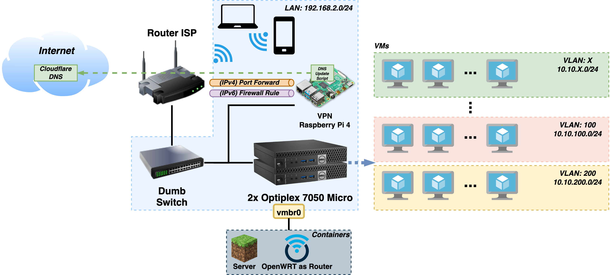
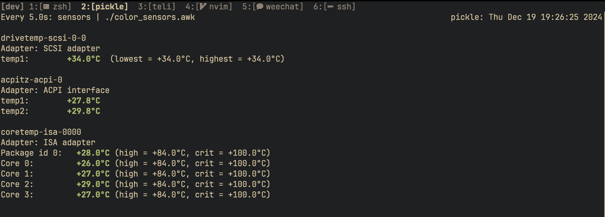

# Homelab

# Router for the VLANs network.
[OpenWRT Config](./openwrt_config.md)

I use OpenWRT as a router to route traffic for the VMs in the different VLANs i assign them to.
I want them to have their own isolated network, but also be able to access the internet.

Im in the process of learning more firewall rules and restricting them further.

# Rasberry Pi as a VPN

Since I want to connect to my homelab from outside my house, but dont want to expose neither of the proxmox dashboards, I'll only expose a VPN tunnel.
That way, it will be as if I'm on my usual LAN network inside my house and dont need to expose anything to the Internet.

I bought a simple Raspberry Pi 4 with only 1Gb to serve as the VPN server, which is running Wireguard and is connected to the same switch as the mini pc's.
Its running Raspberry PI OS Lite headless, using 90Mb of RAM on idle. I installed the Wireguard VPN via PiVPN. Im still debating on wether to install WGDashboard to have a prettier interface to manage the VPN, although it doesnt need much GUY management at all.

# Wake On LAN

I've yet to measure the power draw from both the minipc's on idle when they are turned on but with no VMs running. 
Either way, they will for sure consume less energy if they are in a Wake on LAN mode.
That basically means that when I'm done with them I'll just `shutdown now` them, but they'll be able to be powered ON by another device.
That device will be the Raspberry Pi running the VPN, since he will be on 24/7. On it, I just have to run `wakeonlan device:mac:address` and the mini pc will boot.
[Wake on LAN utility](https://launchpad.net/ubuntu/+source/wakeonlan)

Setting up the devices to be Wake On LAN ready is pretty straightforward. I just referred to Dell's user manual. Keep in mind to disable the options they tell you to disable.
[Optiplex Wake On LAN](https://www.dell.com/support/kbdoc/en-us/000129137/wake-on-lan-wol-troubleshooting-best-practices)

# CPU performance

In an attempt to reduce the effective power draw form the CPU, since im not focused on very performant scenarios/deployments, I've used the [scaling-governor](https://community-scripts.github.io/ProxmoxVE/scripts?id=scaling-governor) script to my cpu scaling mode to powersave.

# Temperature monitoring

For a while i thought about implementing a fancy prometheus or influxDB (which is natively by proxmox) metrics collection system to then display in a Grafana Dashboard.

That is way overkill. I'm really only interested in the temperatures of the CPU. The homelab will not be serving anyone besides me and my VMs. I just dont want the house burning down.

I just grabbed from the Internet an `awk` script which basically colors my `sensors` output, and leave it running in a tmux window which i check periodically. In the future i'll make the window flash something to grab my attention immediately.
The script is [here](./scripts/color_sensors.awk)

Grabbing temperatures every 5s: `watch -n 5 -c 'sensors | ./color_sensors.awk'`

